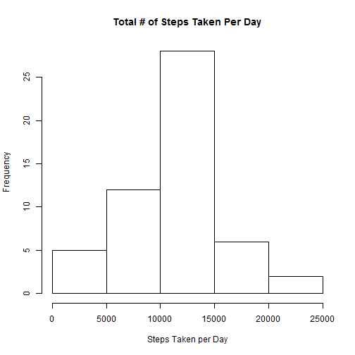
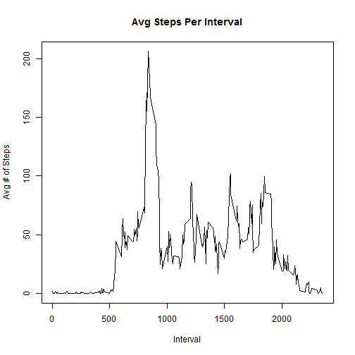
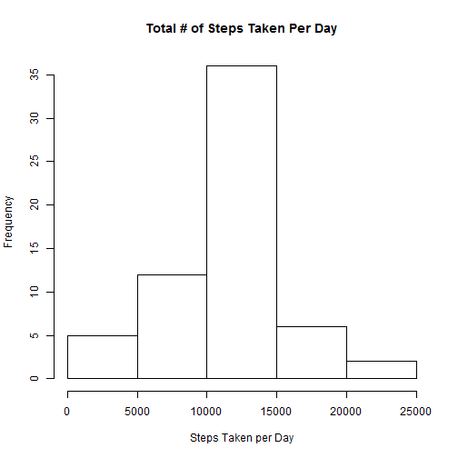
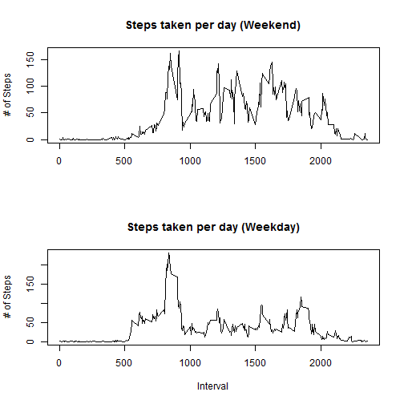

#Assignment #1 - Reproducible Research
## Loading and preprocessing the data
Data taken from <https://d396qusza40orc.cloudfront.net/repdata%2Fdata%2Factivity.zip> on 03/20/2016. We'll use a set without NAs to start so I don't get a headache.

<pre class="knitr r">c &lt;- read.csv('activity.csv')
d &lt;- na.omit(c) #Create a copy with omitted NAs
d$date &lt;- as.Date(d$date, '%Y-%m-%d') #Convert dates            
agg &lt;- aggregate(d$steps, list(d$date), FUN=sum) #Aggregate and return total steps per day
hist(agg$x, main=&quot;Total # of Steps Taken Per Day&quot;, xlab=&quot;Steps Taken per Day&quot;)
</pre>

##Calculate Summary Data for the Daily Data Set

<pre class="knitr r">summary(agg$x)
</pre>

<pre class="knitr r">##    Min. 1st Qu.  Median    Mean 3rd Qu.    Max. 
##      41    8841   10760   10770   13290   21190
</pre>

##Time series plot of the average number of steps taken

<pre class="knitr r">#Aggregate by interval across all days
agginterval &lt;- aggregate(d$steps, list(d$interval), FUN=mean)
#Time series plot by interval
plot(x ~ Group.1, agginterval, type = &quot;l&quot;,
     main=&quot;Avg Steps Per Interval&quot;, xlab='Interval', ylab=&quot;Avg # of Steps&quot;)
</pre>

##The 5-minute interval that, on average, contains the maximum number of steps

<pre class="knitr r">maxint&lt;- agginterval[agginterval$x==max(agginterval$x),]
maxint$Group.1
</pre>

<pre class="knitr r">## [1] 835
</pre>

##Code to describe and show a strategy for imputing missing data
We will use the average for that interval to fill the missing data. We accomplish this by merging datasets based on the interval period and then setting the NAs to the constant value.

<pre class="knitr r">#How many NAs do we have?
length(c[is.na(c)])
</pre>

<pre class="knitr r">## [1] 2304
</pre>

<pre class="knitr r">#use interval average to fill data
merged &lt;- merge(agginterval, c, by.x=&quot;Group.1&quot;, by.y = &quot;interval&quot;)
merged[is.na(merged$steps)==TRUE,]$steps &lt;- merged[is.na(merged$steps)==TRUE,]$x
merged$date &lt;- as.Date(merged$date, '%Y-%m-%d')
merged$dow &lt;- weekdays(merged$date, abbreviate = TRUE)
merged$wknd &lt;- (merged$dow %in% c(&quot;Sat&quot;, &quot;Sun&quot;))
aggm &lt;- aggregate(merged$steps, list(merged$date), FUN=sum)
summary(aggm$x)
</pre>

<pre class="knitr r">##    Min. 1st Qu.  Median    Mean 3rd Qu.    Max. 
##      41    9819   10770   10770   12810   21190
</pre>

<pre class="knitr r">#Histogram of Filled Data
hist(aggm$x, main=&quot;Total # of Steps Taken Per Day&quot;, xlab=&quot;Steps Taken per Day&quot;)
</pre>

##Panel plot comparing the average number of steps taken per 5-minute interval across weekdays and weekends
Group by the weekend feature and then by interval feature producing an average number of steps.

<pre class="knitr r">aggminterval &lt;- aggregate(merged$steps, list(merged$wknd, merged$Group.1), FUN=mean)

par(mfrow=c(2,1))
plot(x ~ Group.2, aggminterval[aggminterval$Group.1==TRUE,], type = &quot;l&quot;,
     main=&quot;Steps taken per day (Weekend)&quot;, xlab=&quot;&quot;, ylab=&quot;# of Steps&quot;)
plot(x ~ Group.2, aggminterval[aggminterval$Group.1==FALSE,], type = &quot;l&quot;,
     main=&quot;Steps taken per day (Weekday)&quot;, xlab=&quot;Interval&quot;,ylab=&quot;# of Steps&quot;)
</pre>

